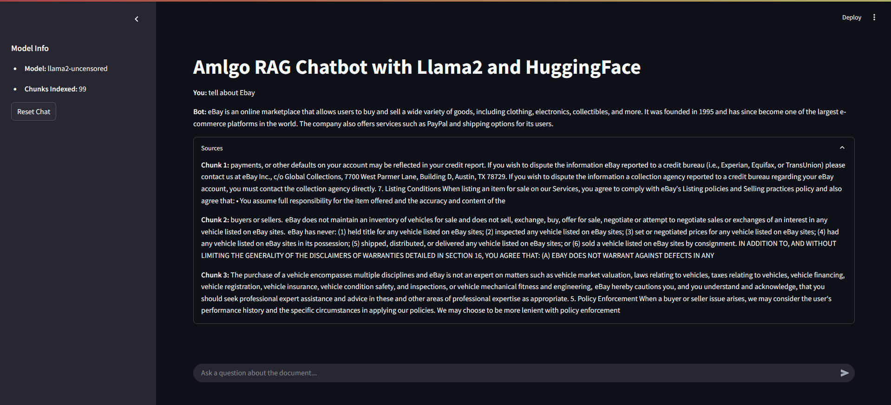
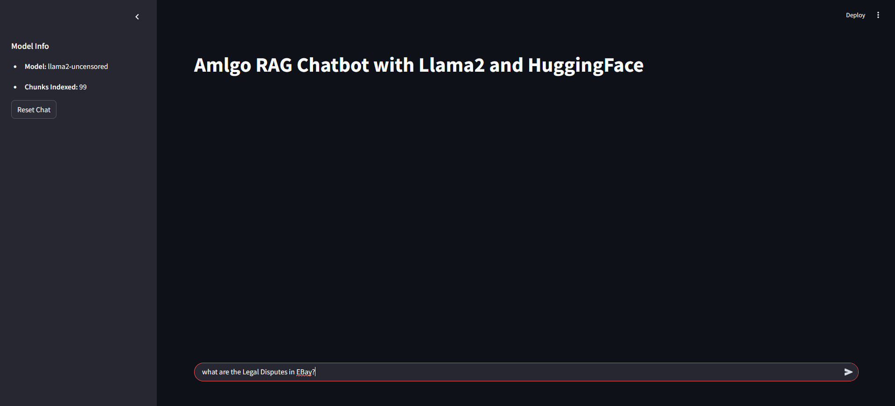
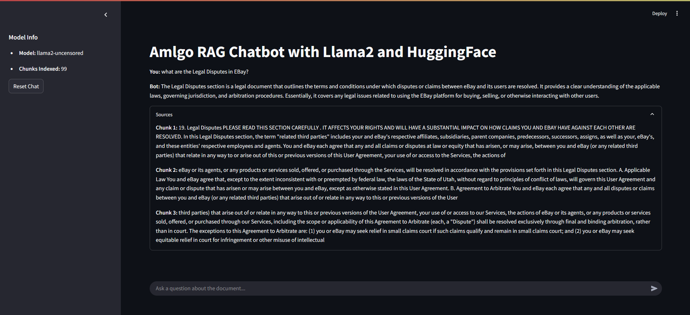

**RAG Chatbot — Ask Questions from a PDF** 


This project is a simple implementation of a RAG (Retrieval-Augmented Generation) chatbot. It allows users to upload a PDF document, ask questions about it, and receive answers that are grounded in the actual content of the document. The main idea is to combine document retrieval and AI-based question answering.


This project uses LangChain, FAISS, and Streamlit. It was built as part of a learning exercise to understand how to combine retrieval systems and language models for document-based Q\\\&A.


**Project Structure and Flow**


User asks a question  System -> finds the most relevant parts of the document -> AI reads those parts -> AI generates an answer


**Main Components:**


\* *PDF Reader*: Extracts text from a PDF file using LangChain's PyPDFLoader

\* *Text Chunker*: Breaks the long document into smaller pieces (chunks)

\* *Embeddings Generator*: Converts each chunk into a numeric vector using a sentence embedding model

\* *FAISS Vector Index*: Stores those vectors to enable fast semantic search

\* *Retriever*: Looks up the most relevant chunks when the user asks a question

\* *LLM (Language Model)*: Uses the retrieved chunks and the question to generate an answer

\* *Streamlit App*: Provides a simple interface to ask questions and see responses


**Setup Instructions**


*Step 1: Extract Text from PDF*


This step reads the PDF file and saves its text:


*python notebooks/pdf\_to\_text.py*


*Step 2: Preprocess Text and Generate Embeddings*


This script splits the text into chunks and creates vector embeddings:


*python notebooks/preprocess\_and\_store.py*


After these steps, you’ll have:


\* *data/document.txt:* Extracted plain text from the PDF

\* *chunks/chunks.json:* The document split into manageable text chunks

\* *vectordb/index.faiss* and *index.pkl:* Vector index used for retrieval


**RAG Pipeline Overview**


Inside the `src/rag\_pipeline.py` file:


1\. The system checks if the FAISS vector index already exists

2\. If not, it preprocesses the document and creates a new index

3\. When a user submits a question, the retriever finds the most relevant chunks

4\. These chunks and the question are passed to the LLM

5\. The LLM generates a response based on the retrieved information


We use a custom prompt to make sure the model doesn’t add unrelated information. Here's the prompt:


```

*You are an AI assistant answering questions based on the following context.*


*Context:*

*{context}*


*Question: {question}*


*Answer (based only on the context above):*

```


**Running the Chat Interface**


To start the chatbot UI, use:


*streamlit run app.py*


Features of the app:


\* Input field to ask questions

\* Displays the answer and also shows the text chunks it used

\* Sidebar shows the model name and number of chunks loaded

\* Option to reset the chat history


**Model and Embedding Details**


Embedding Model


\* *Model:* `BAAI/bge-small-en-v1.5`

\* *Purpose:* Transforms each chunk of text into a vector for semantic similarity

\* *Why Chosen:* It is a lightweight, effective, embedding model and works well on CPUs


Language Model (LLM)


\* *Model:* `llama2-uncensored` (via Ollama)

\* *Purpose:* Generates responses by reasoning over the user query and retrieved chunks

\* *Why Chosen:* Can run locally, doesn’t require internet or GPU


**Installation**


Install the required Python libraries by running:


*pip install -r requirements.txt*


**Notes**


\* The system avoids re-processing if the index already exists

\* To test with a different document, replace `data/AI Training Document.pdf`

\* Chunk size and overlap can be adjusted in the preprocessing script (default: 800 with 100 overlap)


Purpose and Learning


This project explores how retrieval and generation can work together in a chatbot. The goal was to learn how to:


\* Process documents into retrievable form

\* Embed and index them semantically

\* Splitting the data into chunks and storing them locally

\* Query those chunks with AI in a meaningful way

\* Create a pipeline of processes connected sequentially


Working Screenshots



.png)




Demo Video: https://drive.google.com/file/d/1TiVmIg3aj8ha2LmpBcP16eMywi_rO3-H/view?usp=sharing
GitHub Repo: https://github.com/Aaryan-Bansal/RAG-ChatBot-Pipeline


